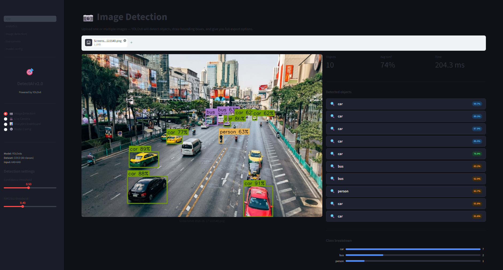

<div align="center">

# 🎯 DetectAI V2

### Real-Time Object Detection & Analytics Platform


**[🚀 Live Demo](#)** · **[📖 Docs](#installation)** · **[🐛 Report Bug](https://github.com/geeta3521/DetectAI-V2/issues)**

---

<!-- 📸 ADD YOUR SCREENSHOT OR GIF HERE
     Recommended: a 5–10 second screen recording showing bounding boxes appearing
     Tools: ShareX (Windows) · Kap (Mac) · peek (Linux)
     Then upload the GIF to your repo and replace the src below -->




</div>

---

## 📌 Overview

DetectAI V2 is a production-ready computer vision web app built with **YOLOv8**, **Streamlit**, and **OpenCV**. It detects objects in images and live webcam feeds in real time, with a full analytics dashboard and export options — deployable to the cloud in minutes.

Built as a major upgrade from a YOLOv4 + Tkinter desktop project:

| | v1 (Old) | v2 (This project) |
|---|---|---|
| Model | YOLOv4 | **YOLOv8** (5× faster, higher mAP) |
| UI | Tkinter (desktop) | **Streamlit** (web, cloud-ready) |
| Export | ❌ None | **✅ CSV, YOLO .txt, annotated JPEG** |
| Analytics | ❌ None | **✅ Full dashboard** |
| Deployment | Local only | **✅ Render / Railway / Streamlit Cloud** |

---

## ✨ Features

### 🖼️ Image Detection
- Upload single or multiple images (JPG, PNG, WEBP, BMP)
- YOLOv8 bounding boxes with confidence scores
- Previous / Next navigation for batch uploads
- Export as **CSV**, **YOLO .txt annotations**, or **annotated JPEG**

### 🎥 Live Camera Detection
- Real-time webcam object detection
- FPS overlay and live object counter
- Adjustable frame rate control
- Detection history saved per session

### 📊 Analytics Dashboard
- Top detected classes — bar chart
- Confidence distribution histogram
- Per-run history table
- Export all session data as CSV

### ⚙️ Model Configuration
- Switch between **yolov8n / s / m / l / x** with one click
- Tune **confidence threshold** and **IoU / NMS threshold** live
- Full COCO 80-class reference table

---

## 🛠️ Tech Stack

| Layer | Technology |
|-------|------------|
| Detection model | YOLOv8 (Ultralytics) |
| Web framework | Streamlit |
| Computer vision | OpenCV |
| Data processing | Pandas, NumPy |
| Deployment | Render / Railway / Streamlit Cloud |

---

## 📂 Project Structure

```
DetectAI-V2/
│
├── app.py                        # Entry point — sidebar navigation
├── requirements.txt              # All dependencies
├── render.yaml                   # One-click Render deployment config
├── README.md
│
├── pages/
│   ├── image_detection.py        # Upload & detect page
│   ├── live_camera.py            # Webcam real-time detection
│   ├── analytics.py              # Session analytics dashboard
│   └── model_config.py          # Model & threshold settings
│
├── utils/
│   ├── detector.py               # YOLOv8 inference engine + exporters
│   ├── session.py                # Session state & history manager
│   └── styles.py                 # Custom CSS injection
│
└── exports/                      # Auto-created — downloaded files land here
```

---

## 🚀 Installation

### Prerequisites
- Python 3.10 or higher
- Webcam (optional — only needed for Live Camera page)

### Steps

```bash
# 1. Clone the repository
git clone https://github.com/geeta3521/DetectAI-V2.git
cd DetectAI-V2

# 2. Create and activate a virtual environment (recommended)
python -m venv venv
source venv/bin/activate       # Linux / Mac
venv\Scripts\activate          # Windows

# 3. Install dependencies
pip install -r requirements.txt

# 4. Run the app
streamlit run app.py
```

Open **http://localhost:8501** in your browser.

> **Note:** YOLOv8 weights (`yolov8s.pt`, ~22 MB) download automatically on first run.

---

## ☁️ Deployment (Free)

### Streamlit Community Cloud *(easiest — recommended)*
1. Push this repo to GitHub
2. Go to [share.streamlit.io](https://share.streamlit.io) → **Deploy an app**
3. Select your repo and point to `app.py`
4. Done — you get a free `yourapp.streamlit.app` URL with HTTPS

### Render
1. Push to GitHub
2. New Web Service → connect repo
3. **Build command:** `pip install -r requirements.txt`
4. **Start command:** `streamlit run app.py --server.port $PORT --server.address 0.0.0.0 --server.headless true`
5. `render.yaml` in this repo does this automatically

### Railway
Same as Render — Railway auto-detects Streamlit projects.

---

## 🎯 Supported Classes (80 COCO)

<details>
<summary>Click to expand full class list</summary>

person · bicycle · car · motorcycle · airplane · bus · train · truck · boat ·
traffic light · fire hydrant · stop sign · parking meter · bench · bird · cat ·
dog · horse · sheep · cow · elephant · bear · zebra · giraffe · backpack ·
umbrella · handbag · tie · suitcase · frisbee · skis · snowboard · sports ball ·
kite · baseball bat · baseball glove · skateboard · surfboard · tennis racket ·
bottle · wine glass · cup · fork · knife · spoon · bowl · banana · apple ·
sandwich · orange · broccoli · carrot · hot dog · pizza · donut · cake · chair ·
couch · potted plant · bed · dining table · toilet · tv · laptop · mouse ·
remote · keyboard · cell phone · microwave · oven · toaster · sink · refrigerator ·
book · clock · vase · scissors · teddy bear · hair drier · toothbrush

</details>

---

## 📈 Roadmap

- [x] YOLOv8 image detection with bounding boxes
- [x] Live webcam detection with FPS monitoring
- [x] Analytics dashboard with class distribution
- [x] CSV / YOLO annotation export
- [x] Multi-model switching (n/s/m/l/x)
- [ ] Video file upload detection
- [ ] Object tracking (DeepSORT / ByteTrack)
- [ ] Custom model training UI
- [ ] Multi-camera support
- [ ] AI-generated detection report (PDF)

---

## 👩‍💻 Author

**Geeta A N**
BE — Artificial Intelligence & Machine Learning

[](https://github.com/geeta3521)
[](https://linkedin.com/in/geeta-nemgouda/)

---

## 📄 License

This project is licensed under the **MIT License** — see [LICENSE](LICENSE) for details.

---

<div align="center">
<sub>⭐ If this project helped you, consider starring the repo — it helps others find it too.</sub>
</div>
